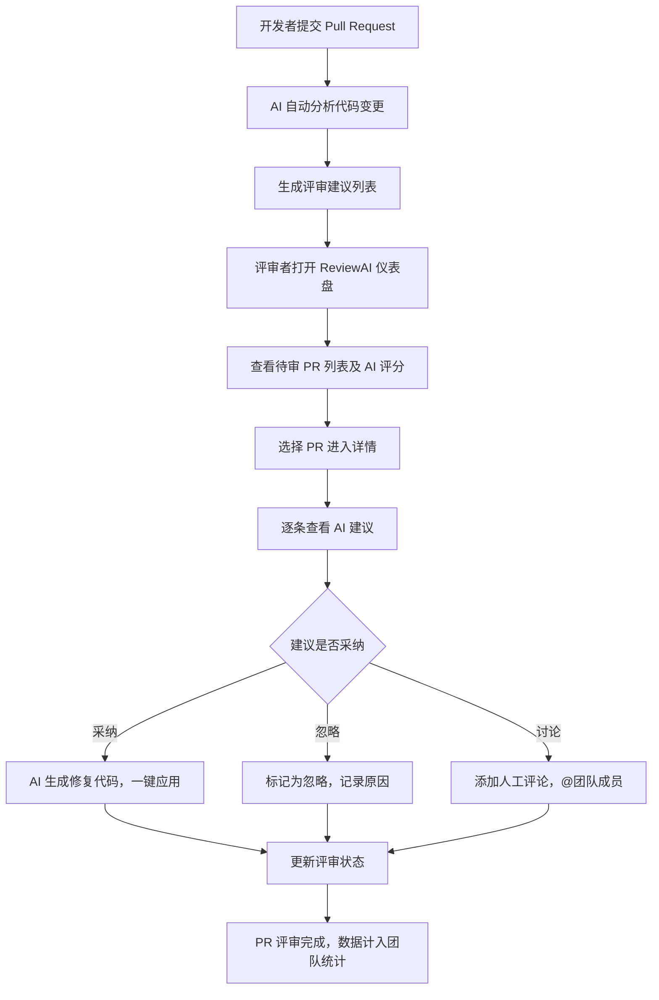

## 1. 产品概述

**ReviewAI** 是一款面向开发团队的 AI 驱动代码评审工具，专注于提升 Pull Request 的 Review 效率与质量。通过 AI 自动分析代码变更、生成智能评审建议、量化代码质量指标，帮助团队将 Review 时间缩短 60% 以上，同时降低人为遗漏风险。

- 主要目的：用 AI 赋能代码评审流程，自动检测代码问题、生成改进建议、追踪评审效率
- 目标用户：中大型开发团队的技术负责人、高级工程师、追求代码质量的开发者

## 2. 核心功能

### 2.1 功能模块

1. **全局导航栏**：品牌 Logo、全局搜索、主导航（仪表盘/PR 评审/代码洞察/团队）、通知中心、用户菜单
2. **仪表盘概览**：核心统计卡片（待审 PR 数、AI 发现问题数、评审效率、代码质量分）、趋势迷你图
3. **PR 评审面板**：PR 列表（含 AI 评分、状态标签）、AI 生成评审建议、代码变更对比视图、一键采纳/忽略建议
4. **AI 建议详情**：问题分类（安全漏洞/性能优化/代码规范/逻辑错误）、严重等级标识、修复代码示例
5. **团队效率看板**：团队成员评审统计、AI 建议采纳率、平均评审周期趋势

### 2.2 页面详情

| 页面名称 | 模块名称 | 功能描述 |
|---------|---------|---------|
| 仪表盘 | 统计概览卡片 | 4 张核心指标卡片：待评审 PR 数、AI 本周发现问题、平均评审时长、代码质量评分，每张卡片含趋势箭头和迷你折线图 |
| 仪表盘 | 近期 PR 列表 | 最近提交的 PR 列表，每项显示标题、作者、AI 评分（0-100）、状态标签（待审/评审中/已完成）、提交时间 |
| 仪表盘 | AI 评审摘要 | 本周 AI 评审统计：发现的问题按严重等级分布（致命/严重/建议/优化），环形图展示 |
| 仪表盘 | 团队效率趋势 | 近 7 天团队评审完成数与 AI 建议采纳率双轴折线图 |
| PR 评审 | PR 筛选栏 | 按仓库、状态、严重程度筛选 PR，搜索框支持关键词匹配 |
| PR 评审 | PR 评审列表 | 可展开的 PR 卡片，展开后显示 AI 标注的代码问题和建议修复方案 |
| PR 评审 | AI 建议面板 | 侧边栏或展开面板，列出 AI 对该 PR 的全部评审意见，支持分类筛选和批量操作 |
| PR 评审 | 代码差异视图 | 左右分栏的 Diff 视图，变更行高亮，AI 问题行内标注（类似行内注释） |

## 3. 核心流程

## 4. 用户界面设计

### 4.1 设计风格

- **品牌定位**：科技感 AI 工具，专业、高效、智能
- **主色调**：
  - 页面背景 `#0a0e1a`（深邃蓝黑，区别于 GitHub 的纯黑）
  - 导航栏 `#0f1324`
  - 卡片背景 `#131829`
  - 边框 `#1e2440`
- **强调色**：
  - 主强调色 `#06d6a0`（电光青绿，代表 AI 智能）
  - 辅助强调色 `#7c3aed`（紫罗兰，代表深度分析）
  - 警告色 `#f59e0b`（琥珀色，用于中等严重度）
  - 危险色 `#ef4444`（红色，用于致命/严重问题）
- **按钮风格**：圆角 8px，主按钮用青绿色渐变背景，次要按钮用透明描边
- **字体**：`"Inter", -apple-system, BlinkMacSystemFont, "Segoe UI", sans-serif`，阅读体验更好的现代无衬线字体
- **布局风格**：顶部固定导航 + 侧边导航栏（折叠式，64px → 240px）+ 主内容区三栏布局，最大宽度 1440px 居中
- **品牌 Logo**：使用代码扫描/雷达图标（Bot + Scan 概念），不用猫形图标
- **图标风格**：Lucide React 图标库，线性描边，hover 时变为品牌青绿色

### 4.2 页面设计概览

| 页面名称 | 模块名称 | UI 元素 |
|---------|---------|--------|
| 仪表盘 | 全局导航栏 | 高度 64px，左侧品牌 Logo（Code2 + 扫描线图标）+ 产品名 "ReviewAI"，中间全局搜索框，右侧通知铃铛 + 用户头像下拉 |
| 仪表盘 | 侧边导航栏 | 折叠宽度 64px（仅图标）/ 展开宽度 240px（图标+文字），导航项：仪表盘、PR 评审、代码洞察、团队、设置，底部用户信息区 |
| 仪表盘 | 统计概览卡片 | 4 列网格布局，每张卡片含图标、数值、标签、环比趋势箭头（绿涨红跌）、迷你 SVG 折线图 |
| 仪表盘 | 近期 PR 列表 | 表格/卡片混合布局，含 PR 标题、仓库名、作者头像、AI 评分进度环、彩色状态标签、时间戳 |
| 仪表盘 | AI 评审摘要 | 环形图卡片，4 种严重度颜色分段，中间显示总数，右侧图例列表 |
| 仪表盘 | 团队效率趋势 | 卡片内含双折线图（完成数/采纳率），hover 显示具体数值 |
| PR 评审 | PR 筛选栏 | 搜索输入框 + 仓库下拉 + 状态多选标签 + 严重度筛选滑块 |
| PR 评审 | PR 评审列表 | 可展开卡片，摘要行显示标题/AI评分/状态，展开后显示 Diff 视图 + 行内 AI 标注 |
| PR 评审 | AI 建议面板 | 右侧飞出面板或内嵌面板，问题列表含图标+严重度+描述+代码示例，采纳/忽略操作按钮 |

### 4.3 响应式设计

- Desktop-first 设计，基准宽度 1440px
- 平板（< 1024px）：侧边导航自动折叠为 64px 仅图标模式，统计卡片 2 列
- 手机（< 640px）：侧边导航变为底部 TabBar，卡片单列堆叠，PR 列表简化显示

### 4.4 动效

- 仪表盘加载时统计数字滚动动画（count-up 效果）
- PR 卡片 hover 时轻微上浮 + 边框高亮为品牌青绿色
- 侧边导航展开/折叠平滑过渡
- AI 评分进度环加载时圆形填充动画
- 问题严重度标签呼吸灯效果（致命等级）持续提醒
- 页面切换时内容区淡入 + 微上移动画
