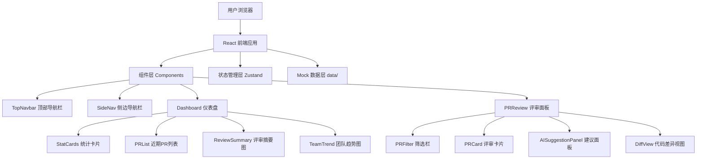

## 1. 架构设计



## 2. 技术说明

- **前端框架**：React@18 + TypeScript
- **构建工具**：Vite@5
- **样式方案**：Tailwind CSS@3
- **状态管理**：Zustand（导航折叠状态、当前页面路由状态）
- **图标库**：Lucide React
- **路由**：React Router DOM v6
- **后端**：无（纯前端项目，使用 Mock 数据）
- **初始化工具**：vite-init (react-ts 模板)

## 3. 路由定义

| 路由 | 用途 |
|-----|------|
| / | 仪表盘主页，展示核心统计、PR 列表、评审摘要、团队趋势 |
| /review | PR 评审页，展示待审 PR 列表与 AI 评审建议 |

## 4. 数据模型

### 4.1 Mock 数据结构

```typescript
// 当前用户
interface CurrentUser {
  name: string
  login: string
  avatarUrl: string
  team: string
}

// 统计指标
interface DashboardStats {
  pendingPRs: number
  pendingTrend: number
  aiIssuesFound: number
  issuesTrend: number
  avgReviewTime: number
  reviewTimeTrend: number
  codeQualityScore: number
  qualityTrend: number
}

// Pull Request
interface PullRequest {
  id: number
  title: string
  repo: string
  author: { name: string; avatarUrl: string }
  aiScore: number
  status: 'pending' | 'in_review' | 'completed'
  issuesCount: { critical: number; major: number; suggestion: number; optimization: number }
  createdAt: string
  updatedAt: string
  branch: string
  targetBranch: string
  filesChanged: number
  additions: number
  deletions: number
}

// AI 评审建议
interface AISuggestion {
  id: number
  prId: number
  severity: 'critical' | 'major' | 'suggestion' | 'optimization'
  category: 'security' | 'performance' | 'style' | 'logic' | 'best_practice'
  file: string
  line: number
  title: string
  description: string
  suggestionCode: string
  currentCode: string
  status: 'pending' | 'accepted' | 'ignored' | 'discussing'
}

// 评审摘要
interface ReviewSummary {
  total: number
  critical: number
  major: number
  suggestion: number
  optimization: number
}

// 团队趋势
interface TeamTrendPoint {
  date: string
  completed: number
  acceptance: number
}
```

## 5. 组件树

```
App
├── TopNavbar
│   ├── BrandLogo (Code2 + ScanLine 图标)
│   ├── GlobalSearch
│   └── UserMenu (通知 + 头像)
├── LayoutShell
│   ├── SideNav
│   │   ├── NavItem (仪表盘)
│   │   ├── NavItem (PR评审)
│   │   ├── NavItem (代码洞察)
│   │   ├── NavItem (团队)
│   │   ├── NavItem (设置)
│   │   └── UserFooter
│   └── MainContent
│       ├── Dashboard (/)
│       │   ├── StatCard (×4)
│       │   ├── PRListTable
│       │   ├── ReviewSummaryRing
│       │   └── TeamTrendChart
│       └── PRReview (/review)
│           ├── PRFilterBar
│           ├── PRCard (×N, expandable)
│           │   ├── ScoreRing
│           │   ├── DiffPreview
│           │   └── SuggestionList
│           └── AISuggestionPanel
```
